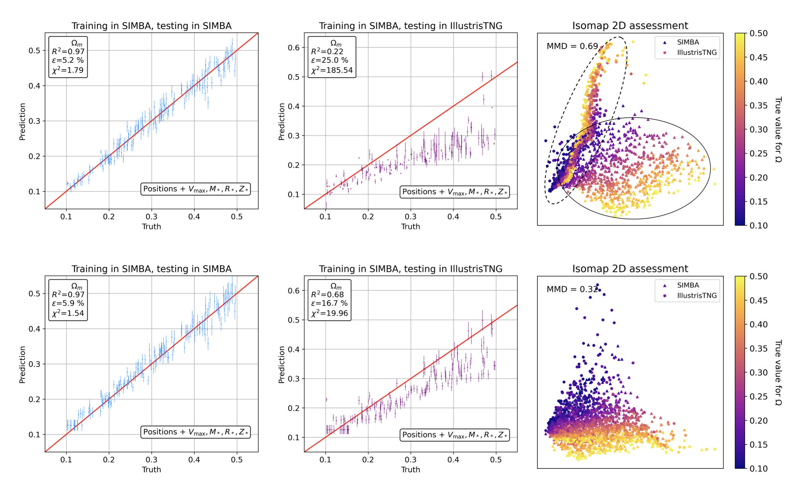

<p align="justify">
Deep learning models have been shown to outperform methods that rely on summary statistics, like the power spectrum, in extracting information from complex cosmological data sets.
However, due to differences in the subgrid physics implementation and numerical approximations across different simulation suites, models trained on data from one cosmological simulation show a drop in performance when tested on another.
Similarly, models trained on any of the simulations would also likely experience a drop in performance when applied to observational data.
Training on data from two different suites of the CAMELS hydrodynamic cosmological simulations, we examine the generalization capabilities of Domain Adaptive Graph Neural Networks (DA-GNNs). 
By utilizing GNNs, we capitalize on their capacity to capture structured scale-free cosmological information from galaxy distributions. 
Moreover, by including unsupervised domain adaptation via Maximum Mean Discrepancy (MMD), we enable our models to extract domain-invariant features.
We demonstrate that DA-GNN achieves higher accuracy and robustness on cross-dataset tasks (up to $28\%$ better relative error and up to almost an order of magnitude better $\chi^2$). Using data visualizations, we show the effects of domain adaptation on proper latent space data alignment. 
This shows that DA-GNNs are a promising method for extracting domain-independent cosmological information, a vital step toward robust deep learning for real cosmic survey data.
</p>

<p align="center">
    
</p>
<p align="justify">
    <em>Comparison of models without (top row) and with DA (bottom row), trained on the SIMBA suite. Training data graphs include 3D positions, maximum circular velocity, stellar mass, stellar radius, and stellar metallicity. From left to right, we report: a scatter plot for the value of Ω<sub>m</sub> on 1) the same domain, 2) cross-domain and 3) the isomap showing how the GNN is encoding the two datasets in the latent space (SIMBA - triangles, IllustrisTNG - circles). In the non-domain adapted isomap, ellipses highlight regions where distributions lie, showing the difference between simulation encodings that leads to a substantial drop in performance on the cross-domain task.</em>
</p>

This work was accepted to the Machine Learning and the Physical Sciences Workshop at the 37th Conference on Neural Information Processing Systems (NeurIPS 2023).

Paper is available on: [arXiv](https://arxiv.org/abs/2311.01588), [NeurIPS workshop website](https://nips.cc/virtual/2023/76180).

## Quickstart

To download the data
> python3 src/scripts/utils/downloading_data.py

To reproduce paper results with the pretrained model files, set the PRETRAINED_MODEL variable to True and run
> python3 src/assessment.py

To retrain the models abd assess them set the PRETRAINED_MODEL to False and run
> python3 src/assessment.py

For all optimization runs information and details consult the file hyperparams_optimization.py

## Citation 

```
@ARTICLE{2023arXiv231101588R,
       author = {{Roncoli}, Andrea and {{\'C}iprijanovi{\'c}}, Aleksandra and {Voetberg}, Maggie and {Villaescusa-Navarro}, Francisco and {Nord}, Brian},
        title = "{Domain Adaptive Graph Neural Networks for Constraining Cosmological Parameters Across Multiple Data Sets}",
      journal = {arXiv e-prints},
     keywords = {Astrophysics - Cosmology and Nongalactic Astrophysics, Computer Science - Artificial Intelligence, Computer Science - Machine Learning},
         year = 2023,
        month = nov,
          eid = {arXiv:2311.01588},
        pages = {arXiv:2311.01588},
          doi = {10.48550/arXiv.2311.01588},
archivePrefix = {arXiv},
       eprint = {2311.01588},
 primaryClass = {astro-ph.CO},
       adsurl = {https://ui.adsabs.harvard.edu/abs/2023arXiv231101588R},
      adsnote = {Provided by the SAO/NASA Astrophysics Data System}
}
```

## Acknowledgement 
<p align="justify">
The authors of this paper have committed themselves to performing this work in an equitable, inclusive, and just environment, and we hold ourselves accountable, believing that the best science is contingent on a good research environment.
We acknowledge the <a href="https://deepskieslab.com/">Deep Skies Lab</a> as a community of multi-domain experts and collaborators who have facilitated an environment of open discussion, idea generation, and collaboration. This community was important for the development of this project. 

This manuscript has been supported by Fermi Research Alliance, LLC under Contract No. DE-AC02-07CH11359 with the U.S. Department of Energy (DOE), Office of Science, Office of High Energy Physics. 

This work was supported by the EU Horizon 2020 Research and Innovation Programme under the Marie Sklodowska-Curie Grant Agreement No. 690835, 734303, 822185, 858199, 101003460.

The CAMELS project is supported by the Simons Foundation and the NSF grant AST2108078.
</p>
